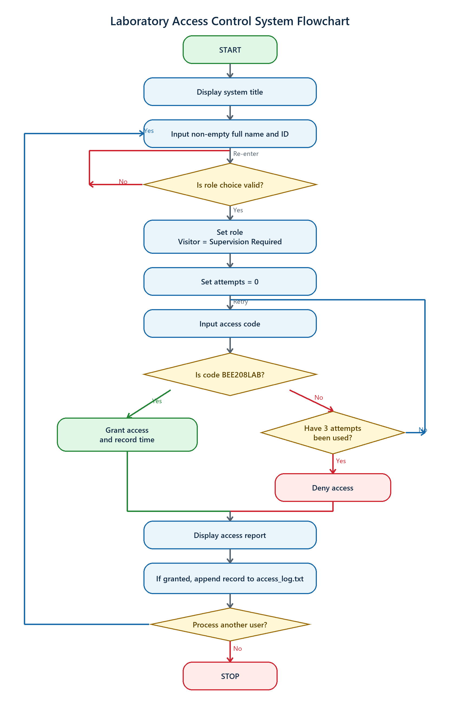
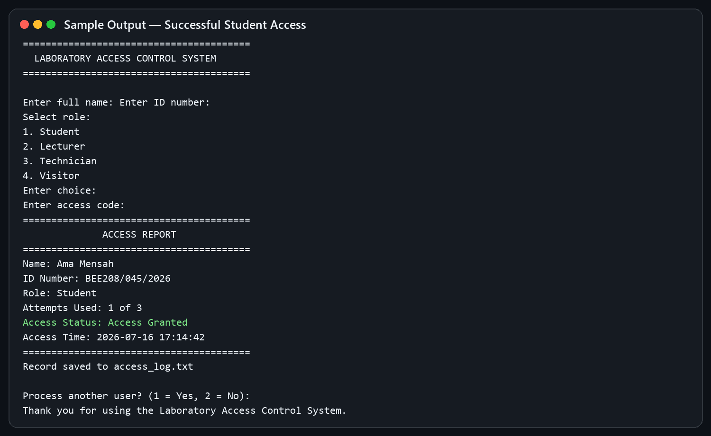
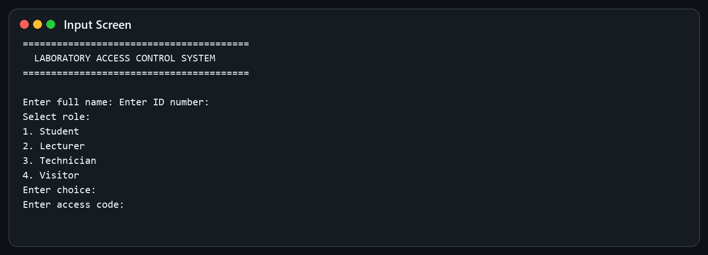
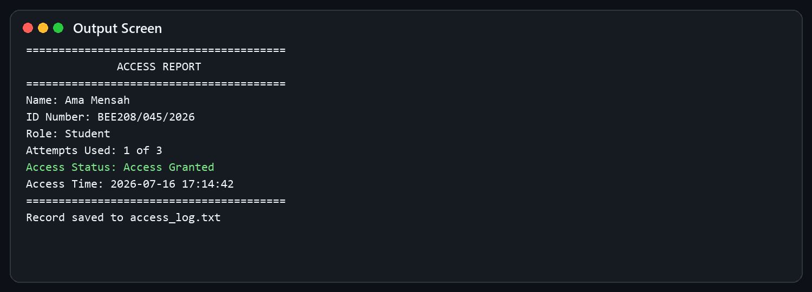
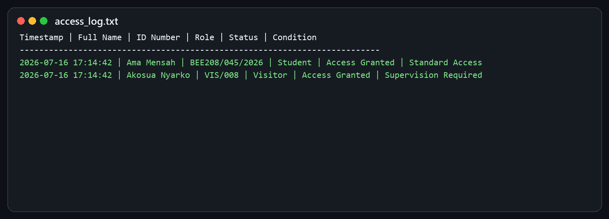

# Laboratory Access Control System

## Submission Information

| Field | Details |
|---|---|
| Course Code | BEE 208 |
| Project Title | Laboratory Access Control System |
| Group Number | 17 |
| Group Members | Afloe Derrick Tetteh — 01243621B<br>Joseph Oppong — 01242622B<br>Arnold — 01242282B<br>Sogbo Prosper Kekeli — 01245631B<br>Quawu Micheal — 01242801B<br>[Add remaining member and index number] |
| GitHub Repository | https://github.com/josephasamoah/BEE208-Laboratory-Access-Control-System |
| Date Submitted | [Add submission date] |

## 1. Introduction

Engineering laboratories contain tools, measuring instruments, components, trainers, meters, and other equipment that must be protected and used responsibly. Manual access records can be incomplete, difficult to search, and unreliable when an institution needs to determine who entered a laboratory and when access was granted. This project presents a simple terminal application that demonstrates how software can validate a user and preserve an access record.

The system is implemented in C++ and focuses on the core programming concepts required for BEE 208: input and output, variables, operators, conditionals, loops, functions, classes and objects, vectors, input validation, and file handling.

## 2. Problem Statement

Manual laboratory access control can lead to missing records, poor accountability, and difficulty tracing authorised entry. A basic software system is required to collect a user’s identity and role, verify an approved access code, limit failed attempts, report the final decision, and save successful access records for later reference.

## 3. Aim and Objectives

### Aim

To develop a C++ Laboratory Access Control System that verifies user access, records access attempts, displays access status, and saves authorised access records to a text file.

### Objectives

1. Identify the input, processing, and output requirements of the system.
2. Design an algorithm, pseudocode, and flowchart for access verification.
3. Develop a working C++ program using functions and a class.
4. Use conditional statements and loops to grant or deny access after at most three attempts.
5. Validate names, IDs, roles, menu selections, and code entries.
6. Use a vector to represent the supported user roles.
7. Append successful records to `access_log.txt`.
8. Test normal, invalid, denied, Visitor, and repeated-user scenarios.
9. Organise and document the complete project in a GitHub repository.

## 4. System Requirements

### Functional Requirements

- Display the application title and clear prompts.
- Collect a non-empty full name and ID number.
- Accept one of four roles: Student, Lecturer, Technician, or Visitor.
- Compare the entered access code with `BEE208LAB`.
- Permit no more than three code attempts for one user.
- Display “Access Granted” for a correct code and “Access Denied” after three failures.
- Mark an authorised Visitor as requiring supervision.
- Show a summary containing identity, role, attempts, status, and time when granted.
- Save successful access records only.
- Allow multiple users to be processed during one run.

### Non-Functional Requirements

- The code should compile with a C++17-compatible compiler.
- Prompts and error messages should be understandable.
- The program should recover safely from invalid input.
- The source should be commented, readable, and divided into focused functions.
- The log should remain plain text and easy to inspect.

### Input, Processing, and Output

| Category | Items |
|---|---|
| Input | Full name, ID number, role choice, access code, repeat choice |
| Processing | Trim and validate text, validate choices, compare code, count attempts, determine Visitor supervision, capture time |
| Output | Error messages, remaining attempts, access report, save confirmation, successful log record |

## 5. Algorithm

The complete step-by-step algorithm is provided in [algorithm.md](algorithm.md). In summary, the program collects validated details, verifies the code in a maximum-three-attempt loop, reports the decision, writes only granted access to the log, and optionally repeats for another user.

## 6. Pseudocode

The full pseudocode is provided in [pseudocode.md](pseudocode.md). It shows the nested validation loops, role lookup, code decision, file-writing condition, and outer multiple-user loop.

## 7. Flowchart

The flowchart below follows the same decisions as the implementation.



## 8. C++ Implementation

### Class and Data Members

The `AccessUser` class represents one access request. Its private members store the user’s full name, ID, role, last access-code entry, access decision, Visitor supervision flag, attempts used, and successful access time. Keeping the state private supports encapsulation.

### Member Functions

- `setUserDetails()` obtains validated identity information and maps a numeric selection to a role stored in a vector.
- `validateRole()` confirms that the role number is within the allowed range.
- `verifyAccessCode()` runs the maximum-three-attempt loop and records a timestamp after success.
- `displayAccessStatus()` prints the complete access report and Visitor condition.
- `saveAccessLog()` appends only successful access records and creates column headings if the file is empty.

### Supporting Functions

- `trim()` removes leading and trailing whitespace so spaces alone cannot pass validation.
- `readRequiredLine()` repeatedly requests non-empty text and handles an ended input stream safely.
- `readChoice()` parses a whole line and rejects letters, extra characters, and out-of-range numbers.
- `currentTimestamp()` creates a portable local date-time string for the log.

### Required C++ Concepts Used

| Concept | Evidence in the program |
|---|---|
| Input and output | `getline`, `cout`, and `cerr` |
| Variables and data types | Strings, integers, Booleans, time values, and objects |
| Operators and expressions | Comparisons, logical operations, arithmetic, and conditional expressions |
| Conditional statements | Grant/deny, remaining attempts, Visitor condition, and file checks |
| Loops | Validation loops, three-attempt loop, and multiple-user loop |
| Functions | Input, trimming, time, verification, display, and logging functions |
| Classes and objects | `AccessUser` class and a new object for each request |
| Arrays or vectors | `vector<string>` containing the four roles |
| File handling | `ifstream` checks and `ofstream` append operations |
| Input validation | Required text and bounded menu choices |

## 9. Sample Input and Output

### Sample Input

```text
Full name: Ama Mensah
ID number: BEE208/045/2026
Role: 1 (Student)
Access code: BEE208LAB
Process another user: 2 (No)
```

### Sample Output



The generated report shows the name, ID, role, one attempt used, “Access Granted,” and the successful access time. The program then confirms that the record was saved.

## 10. Screenshots

### Input Screen



### Output Screen



### File Output



## 11. Testing

The complete test matrix is documented in [test-data.md](test-data.md). Testing covers first- and third-attempt success, three failed codes, supervised Visitor access, empty identity fields, invalid role choices, invalid repeat choices, and multiple users. Successful runs are checked against the log, while denied runs are checked to confirm that no record is written.

## 12. Challenges Faced

1. **Safe mixed input:** Reading menu numbers and full lines can leave unwanted characters in the input stream. The solution reads every entry as a full line and parses menu choices separately.
2. **Whitespace validation:** A field containing only spaces should not be treated as a name or ID. A trimming function solves this before checking for empty input.
3. **Visitor policy:** The project permits Visitors to be restricted or supervised. This implementation chooses supervised access after correct code verification and states that condition in both the report and log.
4. **Portable timestamps:** Windows and non-Windows systems use different safe local-time functions, so conditional compilation supports both environments.
5. **Log headings:** Appending headings on every run would make the file untidy. The program checks whether the log is empty before writing them.

## 13. Individual Contributions

Verified names, index numbers, and actual responsibilities must be entered in [group-contribution.md](group-contribution.md) before submission. Each member should understand and be able to defend the section attributed to them.

## 14. Conclusion

The project meets the specified need for a simple laboratory access-control simulation. It validates user details, supports four roles, limits code attempts, distinguishes supervised Visitor access, reports the result clearly, handles multiple users, and records successful access in a persistent text file. The design demonstrates the required C++ concepts while remaining small enough to explain during a practical defence.

## 15. Future Improvements

- Hide access-code characters while the user types.
- Store a secure hash instead of keeping the approved code directly in the source.
- Use separate permissions or codes for different roles and laboratory areas.
- Add an administrator screen for viewing and searching logs.
- Save denied attempts in a separate security-audit file.
- Replace the text log with a database for larger deployments.
- Connect the system to student/staff identity cards or biometric hardware.
- Add automated unit tests and continuous integration on GitHub.
